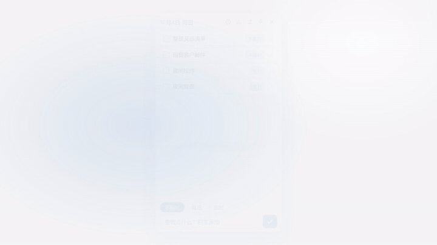

> [!IMPORTANT]
> **本项目由 [GLM-5.3-Flash](https://chatglm.cn) 开发** —— 从 PRD、Rust 引擎、前端、测试到这条宣传片，全流程皆出其手。

<div align="center">

# MyToDo

**再好的 TODO，不如一个用得下去的。**

[](https://github.com/jovanzhang6/MyToDo/actions/workflows/ci.yml)
[](https://github.com/jovanzhang6/MyToDo/actions/workflows/release.yml)
[](LICENSE)
[](https://github.com/jovanzhang6/MyToDo/releases)
[](https://github.com/jovanzhang6/MyToDo/releases)



*完整宣传视频：[docs/assets/promo.mp4](docs/assets/promo.mp4) · 由 [Remotion](https://www.remotion.dev/) 逐帧渲染，画面中所有界面均按真实源码像素级复刻*

English | [简体中文](#功能)

</div>

---

MyToDo is a frosted-glass TODO widget that lives on your Windows 11 desktop. Daily tasks reset themselves at midnight, deadline tasks expire and archive themselves, and completion stats (streaks, 30-day heatmap, on-time rate) keep you honest. Built with **Tauri 2 + Rust**, the installer is ~1.3 MB.

## 为什么又是一个 TODO

因为市面上的 TODO 有两种：功能堆到起飞的，和简陋到用三天的。

MyToDo 只做一件事——**把"坚持"自动化**：你只管勾选，其余全部自己运转。

- 每日任务？第二天自己满血回来，不用重建。
- 限时任务？到期自己归档走人，不用收拾。
- 做了多少？进度环、连续打卡、30 天热力图、按期完成率，它替你记账。
- 挡屏幕？收成一颗贴边小球，露 55% 藏 45%，悬停即出。

## 功能

| | 能力 | 一句话 |
|---|---|---|
| 悬浮窗 | 磨砂玻璃小组件 | 常驻右上角，Acrylic 材质，透明度滑杆实时可调 |
| 三类任务 | 每日 / 限时 / 不限时 | 类型随时互转，生命周期全自动 |
| 完成流 | 勾选即划线 | 次日自动清理，完成后沉底排序 |
| 统计页 | 独立整页 | 进度环 / 连续打卡与最长纪录 / 30 天热力图 / 按期完成率 / 积压告警 |
| 到期提醒 | Windows 原生通知 | 到期当天一条聚合 toast，同任务不轰炸 |
| 悬浮球 | 贴边半隐 | 拖哪都行，松手自动贴边，点击展开 |
| 托盘 | 常驻后台 | 关闭即入托盘，开机自启可配，单实例 |

## 下载安装

前往 [**Releases**](https://github.com/jovanzhang6/MyToDo/releases) 下载 `MyToDo_*_x64-setup.exe`，双击安装。

- 无需管理员权限；数据保存在 `%APPDATA%\com.mytodo.app\data.json`，卸载不丢失
- 需要 Windows 10 1809+ / Windows 11（自带 WebView2）

## 从源码构建

```bash
# 前置：Rust (stable-msvc) + Node.js 20+ + pnpm
pnpm install
pnpm tauri dev      # 开发调试
pnpm tauri build    # 产出安装包（src-tauri/target/release/bundle/nsis/）
```

## 测试

```bash
cd src-tauri
cargo test          # 32 个单元测试：任务生命周期、跨天等价性、贴边几何、统计口径、提醒去重、持久化
```

引擎层的所有时间均为注入（`today` 参数），跨天/休眠补偿等边界全部可测。

## 架构

```
src-tauri/src/
├── todo.rs      # 任务引擎：纯函数 + 注入日期（生命周期/排序/类型转换）
├── stats.rs     # 统计：streak、热力图、按期率、积压告警（只读）
├── notify.rs    # 到期提醒：去重判定纯函数 + toast 薄壳
├── store.rs     # JSON 原子持久化（临时文件 + rename）
├── commands.rs  # Tauri 命令层
└── window.rs    # 窗口几何/材质/悬浮球（贴边不变式 + 自绘拖拽）
src/ui/          # 无框架 TS：清单 / 统计 / 设置 / 悬浮球
```

设计原则：**业务逻辑全部下沉 Rust 纯函数**（时间注入、可单测），前端只做展示；数据为单 JSON 文件（原子写入，含 schema 版本）。

> `docs/vibe/` 收录了本项目从 PRD 到发布的完整工作流档案（含每个设计决策的取舍记录），是 vibe-coding 方法论的实战样本。`promo-video/` 是宣传片的 Remotion 源码——README 里的动图就是它渲染的。

## Roadmap

- macOS 适配（架构已预留，见 `docs/vibe/mytodo/decisions.md`）
- 悬浮球位置记忆
- 数据导出 / 备份
- MCP Server：在你的 AI 助手里直接读写任务

## License

[MIT](LICENSE) © 2026 jovanzhang6
